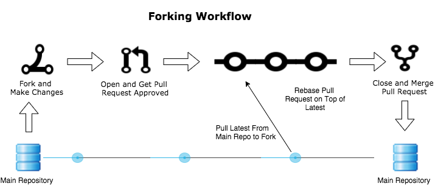

### Forking Workflow in Git

Forking workflow differs from other workflows that use a single "centralized" repository by having a server-side repository for every developer; those repositories are forked from the official repository.
This is most common with public open source projects.

---

*Source: https://docs.rhodecode.com/4.x/rce/collaboration/workflow-fork.html*

---

### The Benefits of Forking Workflow
- Contributers of the project may add, edit and commit changes without giving them write access to the official codebase.
- Only the project maintainer may push commits to the official repository.
- It provide a flexible way for large, organic teams to collaborate sercurely, that is including untrusted third parties.
