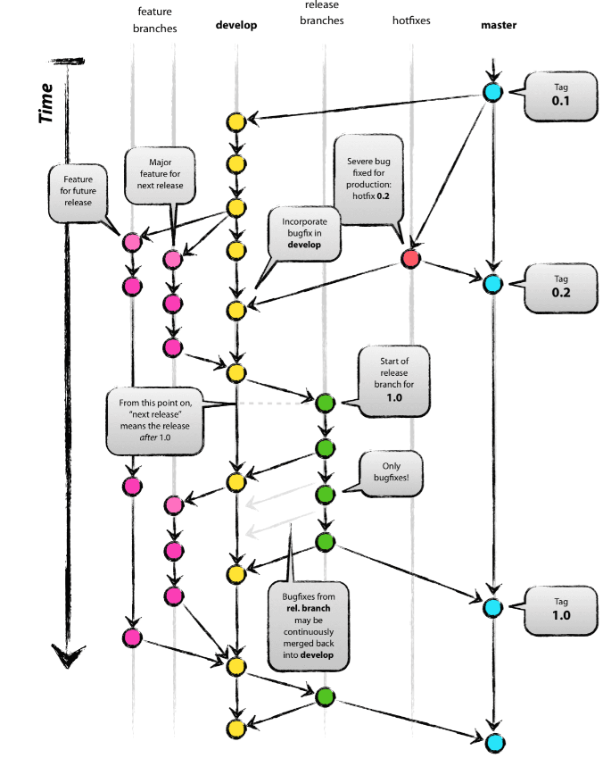

## Gitflow Workflow

This version control method is a more modern approach to handling large projects in an efficient manner. It involves using different **feature branches** and  **multiple primary branches** which all have their specific roles. Compared to *Feature Branch Workflow* which uses one central branch (e.g. main) this branching strategy allows for more structured and robust way for introducing scheduled large updates and patches.  

***

*Source: Driessen, V., [A successful Git branching model](https://nvie.com/posts/a-successful-git-branching-model/)*

***

### Main branch

- This branch stores an **official release history**. 
- The commits to this branch are not frequent and tend to be tagged with their specific versions.
- New commits are either hotfixing bugs or introducing new major updates 
- **Goal** - allows having a stable version of a project

